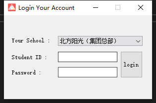
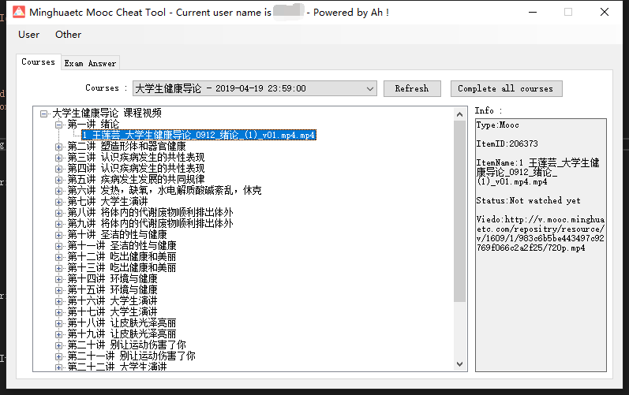
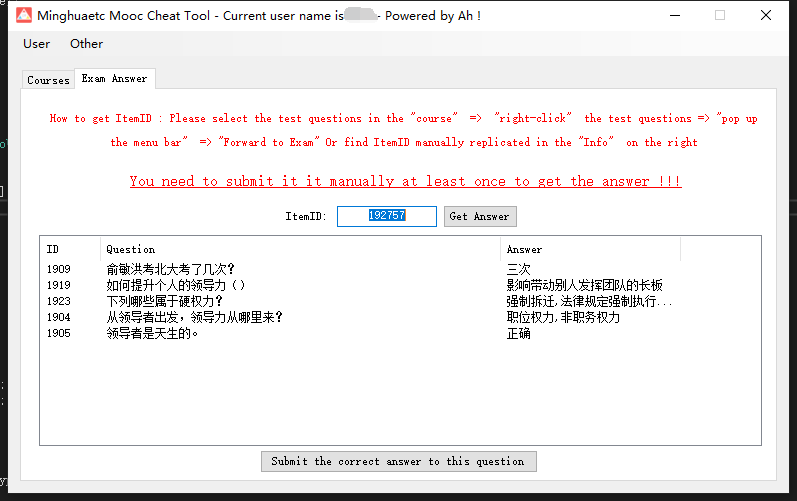

# minghuaetc-hack-CSharp
C# 名华慕课刷课时工具 Android App 协议 直接使用Visual Studio打开

## 该仓库的版本已过时 新仓库
[minghuaetc-hack-Go](https://github.com/dirname/minghuaetc-hack-Go)

## 更新说明

+ 增加学校选择和登陆
+ 增加了一键刷课
+ 修复了一键刷课遇到课后习题自动停止的bug
+ 增加课后习题答案获取和提交（您可能需要至少先提交一次才能获取到答案）

## 环境引用

.NET 4.6.1 
Newtonsoft.Json (请遵守Newtonsoft.Json的开源协议)
RestSharp (请遵守RestSharp的开源协议)

## 免责申明

本项目仅供学习交流，请于下载的24小时内务必删除，切勿用作商业和非法用途

## 预览图

